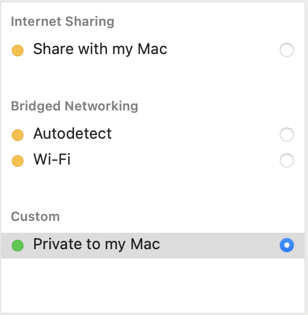

# SIEM Implementation and Log Analysis

## Project Overview

This project documents my first full cybersecurity homelab focused on SIEM implementation, log forwarding, and basic attack simulation.

I built the lab on a repurposed 2019 MacBook Pro using VMware Fusion. The goal was to create a small isolated environment where I could generate activity from an attacker machine, log that activity on a vulnerable target, and forward those logs into Splunk for analysis.

The lab uses three main virtual machines:

- Kali Linux as the attacker machine
- Metasploitable as the vulnerable target
- Ubuntu Server running Splunk Enterprise as the SIEM

The main outcome of this lab was getting failed SSH login attempts from Kali Linux to appear as searchable events inside Splunk.

This project helped me practice virtualization, Linux administration, network troubleshooting, syslog forwarding, Splunk configuration, and basic security event analysis.

---

## Technologies Used

- VMware Fusion
- Kali Linux
- Metasploitable
- Ubuntu Server
- Splunk Enterprise
- Linux CLI
- SSH
- Nmap
- sysklogd
- Syslog
- iptables
- SCP
- Virtual Networking

---

## Lab Architecture

The lab is organized into three main zones:

| Zone | Virtual Machine | Purpose |
|---|---|---|
| Management Zone | Kali Linux | Attacker machine used for scanning and SSH activity generation |
| Server Zone | Metasploitable | Vulnerable target system used to generate security logs |
| Security Zone | Ubuntu Server + Splunk | SIEM server used for log ingestion and analysis |

All virtual machines were moved to VMware Fusion’s **Private to My Mac** network after setup. This kept the vulnerable lab environment isolated from my home network while still allowing the VMs to communicate with each other.



---

## Project Objectives

### Phase 1 — Homelab Buildout

- Repurpose a 2019 MacBook Pro as a dedicated homelab host
- Install VMware Fusion
- Deploy Kali Linux, Metasploitable, and Ubuntu Server
- Configure isolated virtual networking
- Validate communication between all VMs

### Phase 2 — SIEM Deployment

- Install Splunk Enterprise on Ubuntu Server
- Configure Splunk to run under a dedicated service user
- Resolve Splunk startup and disk space issues
- Confirm Splunk Web access from macOS

### Phase 3 — Attack Simulation

- Use Kali Linux to scan Metasploitable with Nmap
- Identify exposed services on the vulnerable target
- Generate successful and failed SSH authentication attempts

### Phase 4 — Log Forwarding and Analysis

- Configure Metasploitable to forward syslog data
- Configure Splunk to receive UDP syslog events
- Use an iptables redirect to forward UDP 514 traffic to Splunk’s UDP 5515 input
- Confirm failed SSH login events appeared in Splunk Search

---

## Final Outcome

The lab successfully demonstrated an end-to-end SIEM workflow:

```text
Kali Linux SSH attempt
        ↓
Metasploitable authentication log
        ↓
sysklogd forwarding over UDP 514
        ↓
Splunk VM iptables redirect from UDP 514 to UDP 5515
        ↓
Splunk UDP input on port 5515
        ↓
Searchable failed SSH event in Splunk
```

This confirmed that attacker activity generated from Kali could be logged by Metasploitable, forwarded into Splunk, and analyzed through Splunk Search.

---

## Key Milestones I've Noted

- Built a dedicated homelab on a repurposed MacBook Pro
- Installed and configured VMware Fusion
- Created Kali Linux, Metasploitable, and Ubuntu Server VMs
- Moved the lab to an isolated **Private to My Mac** network
- Verified VM-to-VM connectivity with ping tests
- Performed Nmap enumeration against Metasploitable
- Generated SSH login activity from Kali
- Installed Splunk Enterprise on Ubuntu Server
- Configured Splunk to run under a dedicated `splunk` service account
- Resolved Splunk startup issues related to port binding and disk space
- Expanded Ubuntu’s LVM root volume after discovering it was not using the full VMware disk
- Configured Splunk UDP input on port `5515`
- Configured Metasploitable syslog forwarding
- Used iptables to redirect UDP `514` traffic to Splunk’s UDP `5515` input
- Confirmed failed SSH login events appeared in Splunk

---

## Challenges Encountered

This lab required more troubleshooting than I expected. Some of the main issues I ran into were:

- VMware shared folders and drag-and-drop were unavailable before VMware Tools were installed.
- I could not easily paste the Splunk download URL into the Ubuntu VM, so I transferred the Splunk `.deb` file from macOS to Ubuntu using SCP.
- Splunk did not stay running correctly until I created a dedicated `splunk` service user and changed ownership of `/opt/splunk`.
- Splunk startup later failed because Ubuntu’s LVM root volume was much smaller than the VMware disk size.
- Port `8000` was temporarily held by a stale Splunk process, which prevented Splunk Web from restarting cleanly.
- Safari initially could not reach Splunk Web until I verified the correct VM IP and network mode.
- Nmap scans appeared to stall until I used `-n` and `-Pn` to bypass DNS resolution and host discovery.
- Metasploitable uses the older `sysklogd` service, which did not reliably support forwarding logs to a custom remote syslog port.
- The final working solution used Metasploitable’s default UDP syslog forwarding to port `514` and an iptables redirect on the Splunk VM to send that traffic into Splunk’s UDP `5515` input.

These issues helped me better understand Linux services, VM networking, Splunk startup behavior, log forwarding, and practical troubleshooting.

---

## Skills Demonstrated

- SIEM implementation
- Log ingestion and analysis
- Virtual machine deployment
- Network segmentation
- Linux administration
- SSH authentication testing
- Nmap service enumeration
- Syslog forwarding
- Splunk data input configuration
- iptables port redirection
- SCP file transfer
- LVM disk expansion
- Technical troubleshooting and documentation

---

## Screenshots

Screenshots for this lab are organized into the following folders:

```text
screenshots/
├── hardware/
├── kali/
├── log-ingestion/
├── metasploitable/
├── networking/
├── splunk/
└── vmware/
```

Key screenshots include:

- MacBook hardware restoration
- VMware Fusion VM setup
- Private to My Mac network configuration
- VM-to-VM connectivity tests
- Splunk service status
- Splunk Web access
- Nmap scan results
- Metasploitable authentication logs
- Syslog forwarding configuration
- Failed SSH login events appearing in Splunk

---

## Documentation

Additional documentation is available in the `documentation/` folder:

- `homelabsetup.md` — host system preparation, hardware restoration, VMware setup, VM architecture, and networking
- `siemsetup.md` — Splunk installation, service configuration, syslog forwarding, and log ingestion
- `troubleshooting.md` — technical problems encountered during the lab and how they were resolved

---

## Future Improvements

Planned improvements for this lab include:

- Create a formal network topology diagram
- Add Splunk dashboards for SSH authentication activity
- Build detection searches for repeated failed SSH login attempts
- Create alerts for suspicious authentication activity
- Add additional log sources
- Add a Windows Server or Active Directory environment
- Explore Sysmon and Windows event forwarding
- Add pfSense for firewall and routing practice
- Document additional attack simulations and detections

---

## Key Takeaways

This lab gave me hands-on experience building a working SIEM environment from the ground up.

The the core process of the project was validating the full security event pipeline: generating activity from an attacker VM, logging it on a vulnerable target, forwarding it through syslog, ingesting it into Splunk, and confirming the event was searchable.

This project strengthened my understanding of virtualization, Linux administration, log forwarding, Splunk configuration, and practical troubleshooting in a cybersecurity lab environment.
