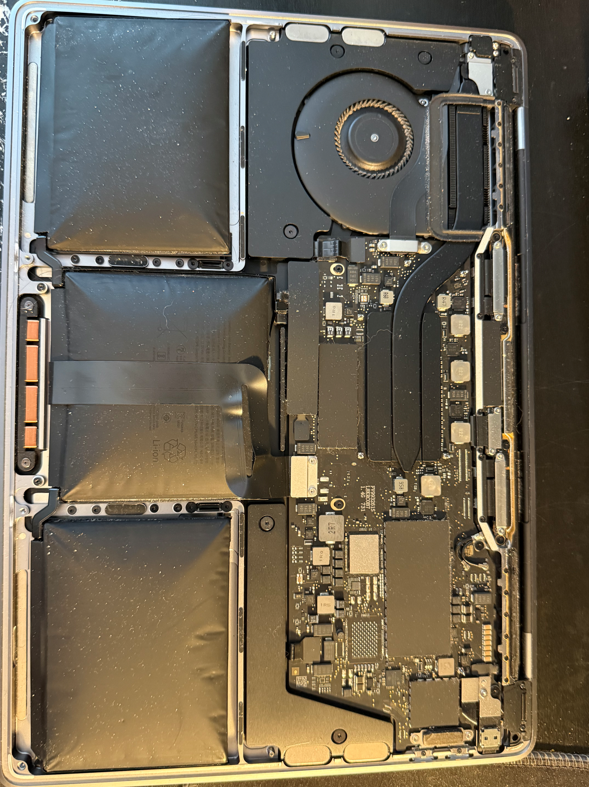
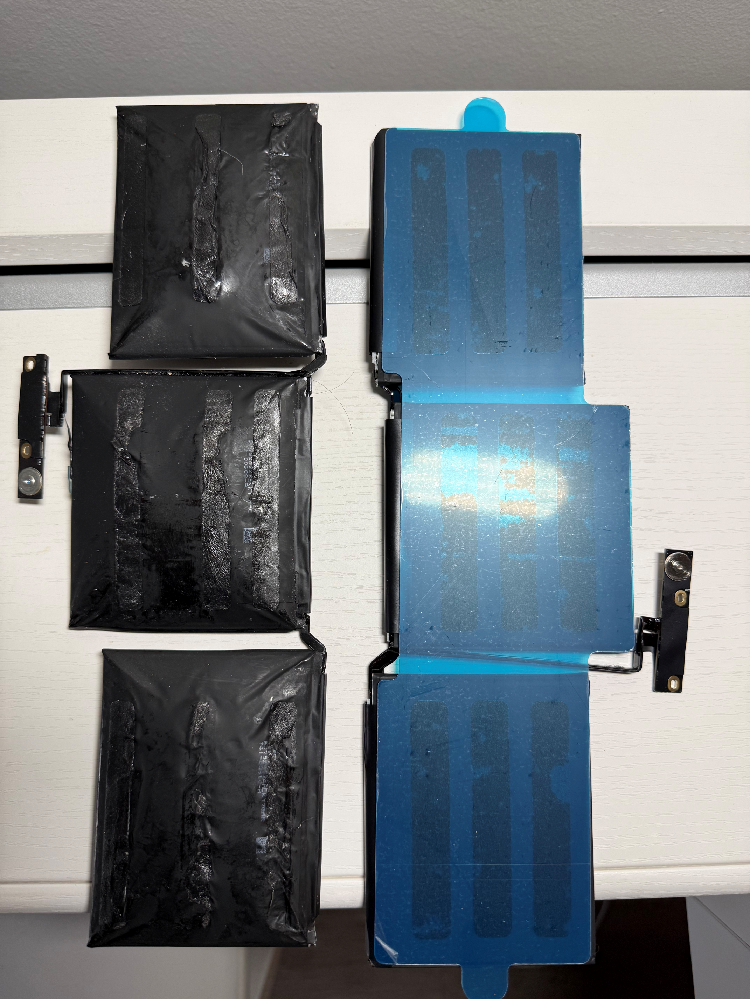
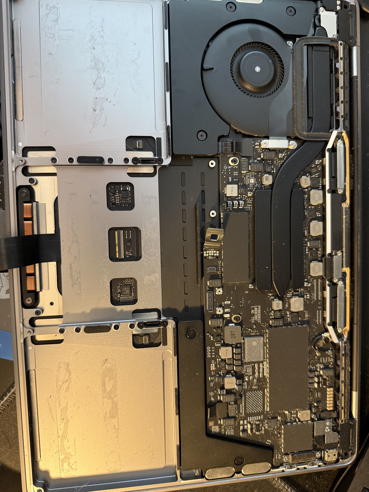
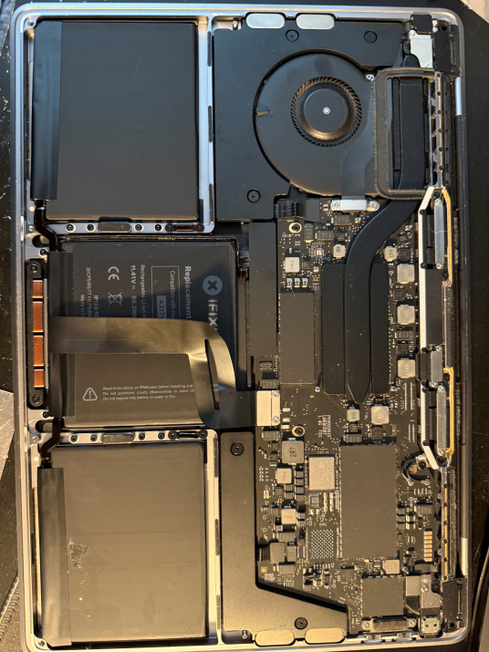
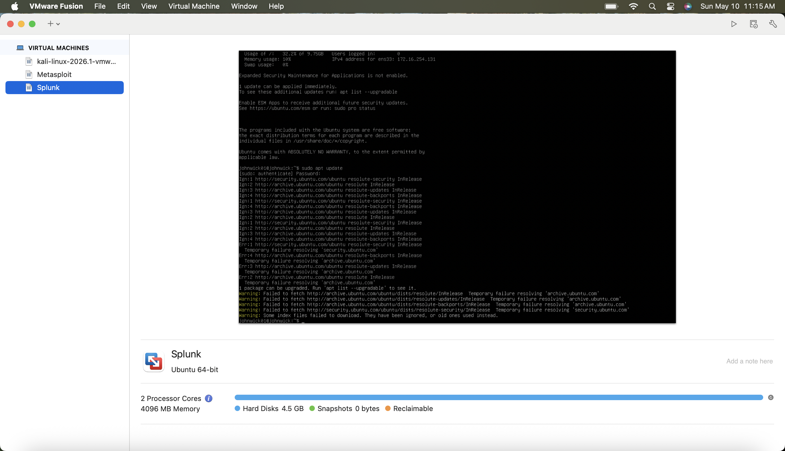

# Homelab Setup

## Overview

This document covers the setup of the homelab environment I used for my SIEM Implementation and Log Analysis project.

I built this lab on a repurposed 2019 MacBook Pro using VMware Fusion. I chose to use this laptop as a dedicated lab machine instead of my personal computer so I could keep the testing environment separate from my day-to-day system.

The goal of the homelab was to create a small, isolated environment where I could safely run a vulnerable target machine, generate activity from an attacker machine, and send logs into Splunk for analysis.

The lab includes:

- Kali Linux as the attacker machine
- Metasploitable as the vulnerable target
- Ubuntu Server running Splunk as the SIEM server

---

## Host System

| Component | Details |
|---|---|
| Host Machine | MacBook Pro 2019 |
| Original OS | macOS Mojave 10.14.6 |
| Updated OS | macOS Sequoia |
| Hypervisor | VMware Fusion |
| Starting Available Storage | 98.95 GB |

---

## Hardware Restoration

Before I used this MacBook as a lab host, I had to deal with a hardware issue. The battery was swollen from previous long-term use and storage conditions, so I replaced it before running any virtual machines on the laptop.

<table>
  <tr>
    <td align="center">
      <br>
      <strong>Swollen Battery Before Replacement</strong>
    </td>
    <td align="center">
      <br>
      <strong>Battery Replacement Components</strong>
    </td>
  </tr>
</table>

<table>
  <tr>
    <td align="center">
      <br>
      <strong>Battery Removal Process</strong>
    </td>
    <td align="center">
      <br>
      <strong>Replacement Battery Installed</strong>
    </td>
  </tr>
</table>

I did not want to run multiple VMs on hardware that already showed signs of battery failure. Since this machine would be used for longer lab sessions, replacing the battery was an important first step before building the environment.

This part of the project was not directly cybersecurity-related, but it mattered because the lab depended on the hardware being safe and stable.

Benefits of hardware restoration I noticed:

- Safer operation during longer lab sessions
- More reliable power behavior
- Better hardware stability
- Reducing risk while running multiple virtual machines

Photos were taken during the battery replacement process and will be stored under:

---

## Host Operating System Upgrade

The MacBook was originally running macOS Mojave 10.14.6. Before installing VMware Fusion and building the lab, I upgraded the system to macOS Sequoia.

I made this upgrade because Mojave was outdated and could have caused compatibility problems with newer virtualization tools, Linux ISO files, and security software.

The upgrade helped improve:

- VMware Fusion compatibility
- Support for modern Linux distributions
- Security patching
- System stability
- Long-term usability for the lab

---

## Hypervisor Selection

I used VMware Fusion as the Type-2 hypervisor for this lab.

I chose VMware Fusion because its compatible on macOS and gives enough control over VM networking, CPU, memory, and disk resources. It also gave me experience with a virtualization platform that is closer to what is commonly used in professional environments.

### Why VMware Fusion was useful

VMware Fusion allowed me to:

- Create and manage multiple virtual machines
- Configure isolated VM networking
- Allocate resources to each VM
- Run Linux-based security tools
- Keep the lab separated from my main system
- Move VMs between NAT and Private to My Mac networking during setup

---

## Virtual Machine Architecture

The lab was designed around three main systems.

| Zone | Virtual Machine | Purpose |
|---|---|---|
| Management Zone | Kali Linux | Attacker machine for scanning and SSH testing |
| Server Zone | Metasploitable | Vulnerable target system |
| Security Zone | Ubuntu Server + Splunk | SIEM server for log ingestion and analysis |



This setup allowed me to practice both offensive and defensive workflows. Kali was used to generate activity, Metasploitable recorded that activity in its logs, and Splunk was used to ingest and search those logs.

---

## Kali Linux VM

Kali Linux was used as the attacker machine in the lab.

I used Kali to:

- Test connectivity to other VMs
- Run Nmap scans
- Identify open ports on Metasploitable
- Generate SSH login activity
- Create failed authentication events for Splunk to analyze

Kali was placed on the same isolated VMware network as the other lab VMs so it could communicate with Metasploitable and Splunk without exposing the lab to my home network.

---

## Metasploitable VM

Metasploitable was used as the intentionally vulnerable target system.

I chose Metasploitable because it is designed for security practice and includes multiple exposed and vulnerable services. This made it a good target for basic scanning, SSH testing, and log generation.

Metasploitable was imported using an existing virtual disk instead of installing a new operating system from scratch.

### Why Metasploitable was useful

Metasploitable gave me a safe target for:

- Port scanning
- Service enumeration
- SSH authentication testing
- Log generation
- Practicing SIEM ingestion workflows

Because Metasploitable is intentionally vulnerable, I made sure it stayed inside the isolated lab network.

---

## Ubuntu Server VM

Ubuntu Server was used as the base operating system for the Splunk SIEM server.

I chose Ubuntu Server because it is lightweight, commonly used in server environments, and supports Splunk installation through a `.deb` package.

This VM eventually became the Splunk server responsible for receiving and indexing logs from Metasploitable.

---

## Network Configuration

The lab used VMware virtual networking.

During setup, I used two different network modes:

| Network Mode | How it was used |
|---|---|
| NAT / Share with My Mac | Used during installation and setup when internet access was needed |
| Private to My Mac | Used for the final isolated lab network |


---

## NAT Networking

I used NAT networking during the earlier setup stages because the Ubuntu Server VM needed internet access for installation, updates, and troubleshooting.

NAT was helpful for:

- Ubuntu package updates
- Installing required tools
- General setup tasks
- Getting Splunk installed and running

NAT was not the final networking mode for the lab. It was mainly used to make setup easier.

---

## Private to My Mac Networking

After Splunk was installed and working, I moved the lab to VMware Fusion’s **Private to My Mac** network.

This was the better option for the final lab because it kept the vulnerable environment isolated while still allowing communication between:

- Kali Linux
- Metasploitable
- Ubuntu Server running Splunk
- The macOS host browser accessing Splunk Web

This setup allowed the lab to function without exposing vulnerable services to my home network.

### Importance of isolation

The lab was isolated to:

- Keep Metasploitable away from the home network
- Prevent vulnerable services from being exposed externally
- Keep attack simulation contained
- Create a safer testing environment
- Practice basic network segmentation concepts

---

## Connectivity Validation

After moving the VMs to **Private to My Mac**, I verified that all three machines could communicate with each other.

The validation included:

- Kali pinging Metasploitable
- Kali pinging Splunk
- Splunk pinging Metasploitable
- Confirming each VM had an IP address on the isolated network

This step was important because the rest of the lab depended on the VMs being able to communicate.

Once connectivity was confirmed, I was able to run Nmap from Kali against Metasploitable and later forward logs from Metasploitable into Splunk.

Screenshots for this stage will be stored under:

```text
screenshots/networking/
```

---

## Resource Management

Because this lab runs on a laptop, resource management was important.

I learned quickly that running all VMs at once can put pressure on the host system, especially with Splunk running. To avoid overloading the MacBook, I only kept the VMs running when they were needed.

For example:

| Task | VMs Needed |
|---|---|
| Configuring Splunk | Ubuntu Server only |
| Testing Splunk Web | Ubuntu Server only |
| Running Nmap scans | Kali + Metasploitable |
| Testing log ingestion | Kali + Metasploitable + Splunk |
| Writing documentation | No VMs required |

This helped keep the lab stable and made troubleshooting easier.

---

## Security Considerations

Since Metasploitable is intentionally vulnerable, I treated it differently from a normal VM.

I avoided exposing it to bridged networking or my home network. Instead, I kept it on the isolated VMware network with the rest of the lab.

The main safety decisions were:

- Use a dedicated laptop for the lab
- Keep vulnerable systems isolated
- Use Private to My Mac for the final lab network
- Only run the VMs needed for the current task

---

## Lab Checklist

| Component | Status |
|---|---|
| MacBook battery replacement | Complete |
| macOS upgrade | Complete |
| VMware Fusion installation | Complete |
| Kali Linux VM | Complete |
| Metasploitable VM | Complete |
| Ubuntu Server VM | Complete |
| Splunk installation | Complete |
| Private to My Mac networking | Complete |
| VM-to-VM connectivity | Complete |
| Nmap enumeration | Complete |
| Log ingestion into Splunk | Complete |

---

## Lessons Learned

This setup taught me that building a homelab is not just about installing tools. A lot of the work came from making the environment stable, safe, and connected properly.

The biggest lessons from the homelab setup were:

- Hardware reliability matters before running virtualization workloads
- Older systems and tools can behave differently than modern ones
- NAT is useful during setup, but isolation is better for the final lab
- VM networking needs to be tested before moving into attack simulation
- Resource limits matter when running multiple VMs on a laptop
- Good documentation makes troubleshooting easier later

---

## Next Steps

The homelab now provides the foundation for future security projects.

Possible future improvements include:

- Adding a firewall VM such as pfSense
- Creating a more detailed network topology diagram
- Adding a Windows Server or Active Directory environment
- Adding more log sources
- Building Splunk dashboards
- Creating detection searches and alerts
- Expanding into additional attack simulations
